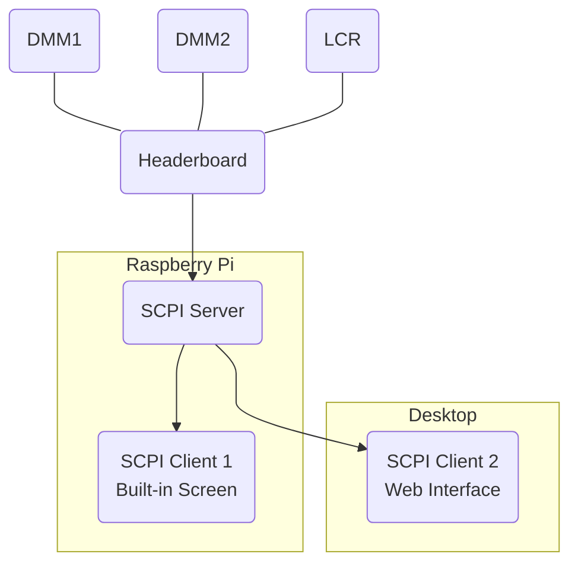

# SCPIProject

## Project Overview



This project implements a SCPI (Standard Commands for Programmable Instruments) server and client system using Python. The server runs on a Raspberry Pi and controls the measurement path of different instruments (DMMs, LCR meter) through a headerboard by manipulating relays. It then talks to the instruments directly over SCPI (not shown) to fetch the measurement values. The client script can be run either as a built-in screen on the Raspberry Pi or a web interface accessible from a desktop.

## Setup Instructions

### 1. Setting Up the Environment (Raspberry Pi and Desktop)

1. **Clone the Repository**  
    Clone this repository to your local machine:
    ```bash
    git clone https://github.com/Christopher-Tan/SCPIProject.git
    cd SCPIProject
    ```

2. **Create a Virtual Environment (Optional but Highly Recommended)**  
    To isolate dependencies and avoid conflicts, create a virtual environment:
    ```bash
    python -m venv venv
    source venv/bin/activate  # On Windows, use `venv\Scripts\activate`
    ```

3. **Install Required Dependencies**  
    Install the required dependencies from the `requirements.txt` file:
    ```bash
    python source/install.py
    ```


### 2. Automatically Start the Server on a Raspberry Pi

To ensure the server starts automatically when the Raspberry Pi boots, follow these steps:

1. **Edit /etc/rc.local**  
Edit this file to look as follows
    ```bash
    #!/bin/bash
    # Replace the following placeholders with your specific details:
    # {env} - Path to your virtual environment's Python binary
    # {project_location} - Path to your SCPIProject folder

    sudo {env}/python3 {project_location}/source/SCPIServer.py &
    ```

    Remember to give the file the following permissions
    ```
    sudo chmod 755 /etc/rc.local
    ```

    ### Example:
    If your virtual environment is located at `/home/pi/venv` and your project is in `/home/pi/SCPIProject`, the script would look like this:
    ```bash
    #!/bin/bash
    sudo /home/pi/venv/bin/python3 /home/pi/SCPIProject/source/SCPIServer.py &
    ```
    If this is indeed your set up, this is a standard default you can use the following script to do all of the above

    ```bash
    echo -e '#!/bin/bash\nsudo /home/pi/venv/bin/python3 /home/pi/SCPIProject/source/SCPIServer.py &' | sudo tee /etc/rc.local
    sudo chmod 755 /etc/rc.local
    ```
